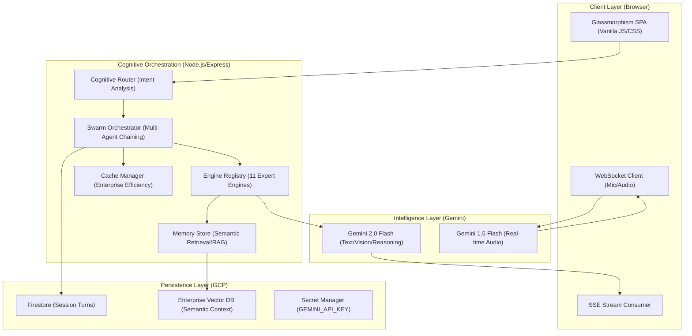

# TriSense OS: Technical Architecture

### Component Breakdown

| Component | Responsibility |
|---|---|
| **Cognitive Router** | Analyzes user intent and autonomously selects the optimal expert engine(s). |
| **Swarm Orchestrator** | Coordinates multi-intent chaining and merging results from multiple agents. |
| **Engine Registry** | Manages 11 specialized personas with tailored system instructions and UI metrics. |
| **Memory Store** | Implements long-term semantic persistence via Vector RAG. |
| **Security Layer** | Multi-layer guardrails and API Quota Resilience (429 Fallback). |
